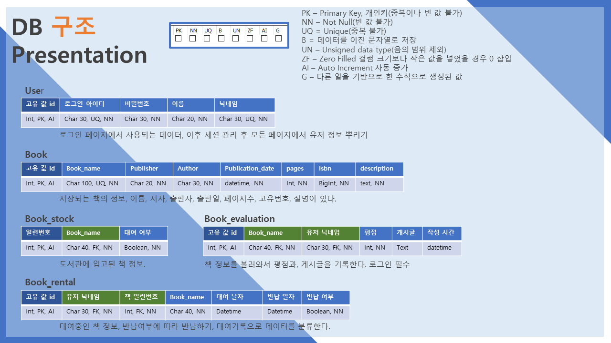
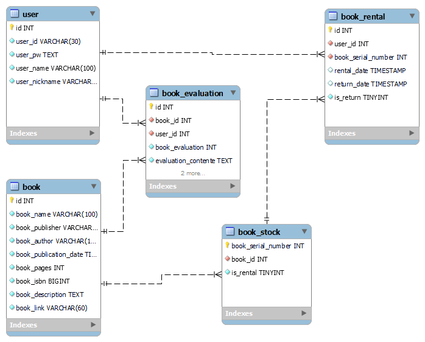

# 3기_도서관대출서비스_이재근

|  이름  |     이메일         |
| :---:  |    :---:           |
| 이재근 | ljkean14@gmail.com |

***

- [3기_도서관대출서비스_이재근](#3기_도서관대출서비스_이재근)
  - [프로젝트 구성](#프로젝트-구성)
    - [프로젝트 일정](#프로젝트-일정)
    - [프로젝트 필요 기능](#프로젝트-필요-기능)
    - [프로젝트 사용 기술](#프로젝트-사용-기술)
    - [파이썬 패키지 버전](#파이썬-패키지-버전)
  - [프로젝트 기능 설명](#프로젝트-기능-설명)
  - [프로젝트 구성도](#프로젝트-구성도)
  - [프로젝트 팀원 역활](#프로젝트-팀원-역활)
  - [프로젝트 버전](#프로젝트-버전)
  - [에러 트러블 슈팅](#에러-트러블-슈팅)

***

## 프로젝트 구성

### 프로젝트 일정

| 일정 | 11/15(월)| 11/16(화) | 11/17(수) | 11/18(목) | 11/19(금) | 11/20(토) | 11/21(일) |
| :---:|   :---:  |   :---:   |   :---:   |   :---:   |   :---:   |   :---:   |   :---:   |
| 1주차 |    -    |    OT     |   DB설계  |     -     |책 파일 입력|     -     | 로그인 환경 구성|

| 일정 | 11/15(월)| 11/16(화) |  11/17(수) | 11/18(목) | 11/19(금) | 11/20(토) | 11/21(일) |
| :---:|   :---:  |   :---:   |   :---:   |   :---:   |   :---:   |   :---:   |   :---:   |
| 2주차 |메인페이지|대여, 반납, 책정보|나머지 기능|부스트랩 디자인|서버 환경 구성| 배포 에러 확인| 발표 |

### 프로젝트 필요 기능

- 해야할 기능
  - 반납페이지기능
  - 책정보 상세페이지
    - 제목이 길면 줄바꿈이 고장
    - 상세 설명 디자인
    - 채팅기능
    - 로그인 세션 판단
    - 별점기능
  - 메인페이지 페이지네이션
    - ajax를 사용한 페이지 내이션 기능 디자인이 너무 어렵다...
      - a태그 링크를 활용해서 기능을 만들자.

***

- 로그인
- 회원가입
- 로그아웃
- 메인 페이지
- 대여하기
- 반납하기
- 대여기록
  - 없을경우, 있을경우 다르게 출력
- 책 소개

***

### 프로젝트 사용 기술

- Flask
- Mysql
- Jinja2

***

### 파이썬 패키지 버전

> python.3.8\
> certifi            2021.10.8\
> charset-normalizer 2.0.7\
> click              8.0.3\
> colorama           0.4.4\
> Flask              2.0.2\
> Flask-SQLAlchemy   2.5.1\
> greenlet           1.1.2\
> idna               3.3\
> itsdangerous       2.0.1\
> Jinja2             3.0.3\
> MarkupSafe         2.0.1\
> pip                19.2.3\
> requests           2.26.0\
> setuptools         41.2.0\
> SQLAlchemy         1.4.27\
> urllib3            1.26.7\
> Werkzeug           2.0.2

***

## 프로젝트 기능 설명

- 아직 아무 기능 없음

***

## 프로젝트 구성도

- 프로젝트


- DB



***

## 프로젝트 팀원 역활

- 팀장 : 이재근
  - DB 관리 : 이재근
  - 로그인 세션 관리 : 이재근
  - 프론트앤드 관리 : 이재근
  - 데이터 관리 : 이재근

***

## 프로젝트 버전

- 0.0.01
  - DB models 구성
    - User, Book, Book_stock, Book_rental, Book_evaluation

***

- 0.0.02
  - local 환경에 DB 설치

  - mysql key 외부 파일에서 읽어오는 형식으로 노출 제거
  - 메인 페이지, 로그인, 로그아웃 프로토타입 설계

***

- 0.0.03
  - flask app 형식이 아닌 flask factory 형식으로 구조 변경
    - 수많은 from . import  에러 발생
    - blueprint 위치 변경으로 인한 참조 변경
    - html 에서의 url_for 수정해야하는점 파악
  - DB 수정
    - 외부키 전부 개인키로 바꾸기
    - book_stock 데이터 삽입
      - 이후 유저권한 추가하여 관리자가 부족한 책 구입할 수 있는 기능과, 손상된 책을 처분할 수 있도록 table 분리.
  - 디버그 모드 추가하기
  - 프로젝트 일정 만들기
  - 문자열 NN 속성은 빈 문자열 넣는식으로 default값 넣기.
  - Wiki 탬플릿 만들기

***

- 0.0.04
  - 로그인, 회원가입 디자인 수정
    - 부트스트랩을 사용한 프론트앤드 디자인
  - 회원가입 기능 추가
  - 회원가입 조건 추가
    - 아이디, 비밀번호, 이름, 닉네임 조건 추가
  - 회원가입을 위한 정규표현식 작성중
    - 비밀번호 영문, 숫자, 특수문자의 복잡한 규칙의 정규표현 방법 고민

***

- 0.0.05
  - 유저이름, 유저닉네임 100자로 제한 수정.(외국인 미들내임 까지 하면 30자 초과 가능)
  - 출판사, 작가 100자로 제한 수정(외국 서적일 경우 초과 가능)
  - 회원가입 기능 추가
    - 아이디, 비밀번호, 이름, 닉네임 조건 추가
  - 로그인 기능 추가
    - DB에서 아이디를 가져와 확인하고 로그인
  - 메인페이지 추가
    - 로그인 회원가입 링크, 로그인시 로그인 유저 정보와 로그아웃 링크
    - 신간 순서별 책 나열
  - 상세페이지 추가
    - 책 상세정보 출력

***

- 0.0.06
  - 메인페이지 평점 정렬 책 출력
    - 대여중인 책 권수 출력
  - 대여기능
    - 대여중일 경우 대여 불가
    - 남은책이 없을 경우 불가
  - Book_rental 에 정규성을 위해 컬럼 제거

## 에러 트러블 슈팅

- 0.0.04
  - 구조 변화로 인한 error 처리
    - `During handling of the above exception, another exception occurred:`
    - `RuntimeError: No application found. Either work inside a view function or push an application context. See http://flask-sqlalchemy.pocoo.org/contexts/.`
      - flask-sqlalchemy 해결방법을 참고하여 해결

***

- 0.0.05
  - 플라스크 세션 에러
    - `RuntimeError: The session is unavailable because no secret key was set.  Set the secret_key on the application to something unique and secret.`
    - [참고 구글링](https://www.google.com/search?q=RuntimeError%3A+The+session+is+unavailable+because+no+secret+key+was+set.++Set+the+secret_key+on+the+application+to+something+unique+and+secret.&rlz=1C1CHBD_enKR901KR901&sxsrf=AOaemvKt0NGwBxmtqW3asXVzyy2RPwru7w%3A1637549431877&ei=dwWbYeXrNKrf2roP_YW4mA0&ved=0ahUKEwilg8GB-6r0AhWqr1YBHf0CDtMQ4dUDCA4&uact=5&oq=RuntimeError%3A+The+session+is+unavailable+because+no+secret+key+was+set.++Set+the+secret_key+on+the+application+to+something+unique+and+secret.&gs_lcp=Cgdnd3Mtd2l6EANKBAhBGABQAFgAYKUEaABwAngAgAEAiAEAkgEAmAEAoAECoAEBwAEB&sclient=gws-wiz)

    ```python
      app.secret_key = 'super secret key'
      app.config['SESSION_TYPE'] = 'filesystem'
    ```

  - 암호화 에러
    - `bcrypt = Bcrypt()` 객체를 선언하지 않음
  - 디버그모드 설정 에러
    - config 설정, vscode launch설정 등 많은 방법으로 디버그 모드를 실행하였지만 내부 디버그가 출력되지 않음.
      - 이유는 launch.json 에서 `"--no-debugger"` 내부 디버그 사용하지 않는 설정이 있었음.
  - 조건문 범위설정 에러

    ```python
        ## 비밀번호 검증
      elif len(user_pw) < 10:
          ## 최소조건 8자 만족하지 못함
          if len(user_pw) < 8:
              message, messageType = '비밀번호를 8자 이상, 영문, 숫자, 특수문자를 포함되게 만들어야 합니다.', 'danger'
          ## 영문, 숫자, 특수문자 조건
          elif password.match(user_pw) == None:
              message, messageType = '비밀번호를 영문, 숫자, 특수문자를 포함되게 만들어야 합니다.', 'danger'
      ## 영문 숫자, 영문 특수문자, 숫자 특수문자를 하나라도 만족하지 않을경우 
      elif pw_check_1.match(user_pw) == None and pw_check_2.match(user_pw) == None and pw_check_3.match(user_pw) == None:
          message, messageType = '비밀번호가 영문, 숫자, 특수문자 중 2개이상을 포함되게 만들어야 합니다.', 'danger'
    ```
  
  - 2가지 종류의 비밀번호 조건을 만족시키기 위해 광범위한 조건을 설정 하였는데 10자 미만일 경우 조건에 포함되어 다른 조건(이름, 닉네임 조건을 무시해버림)
    - 비밀번호 체크 리스트
      - 아이디 중복 : ✅
      - 아이디 크기(30자) : ✅
      - 아이디 이메일형태 : ✅
      - 비밀번호 8자 이하 : ✅
      - 비밀번호 8자 이상 10자 이하 영문, 숫자, 특수문자 사용 : ✅
      - 비밀번호 10자 이상 영문, 숫자, 특수문자중 2개 이상 사용 : ✅
      - 비밀번호 비밀번호 확인 비교 : ✅
      - 한글과 영문으로만 작성 : ✅
      - 닉네임 중복 : ✅
    - 정규표현식 `^(?=.*[a-zA-Z])(?=.*\d)[^ \t\n\r\f\v]{10,}` 으로 개수를 `len(user_pw)`로 따로 조건을 만들지만 중복 조건으로 8자 이상의 특수문자 모두 사용한 비밀번호가 10자 제한에 걸리는 오류
    - `flask Did you mean 'static' instead?`
      - 새로운 views 추가하면서 왜 연결이 되지 않을까 고민하다 그져 import를 하지 않았다는 간단한 문제를 한참이나 해결하지 못했다...

***

- 0.0.06
  - sqlalchemy orm을 사용하여 join
    - 처음 서비스를 시작할때, 모든 평점이 없어 오류발생
    - 조인 방법을 사용하여 데이터 분석이 어려움
    - pandas를 활용하여 데이터 핸들링
    - 평점을 바로 merge 하는것이 아닌
    - groupby를 활용하여 평균점 계산
    - DataFram to json 오류
      - `new_book = json.loads(new_book.to_json())` 속성을 주지 않아 이상하게 json으로 만들어서 df 형태로 반환
        - `new_book = json.loads(new_book.to_json(orient="records"))` 

